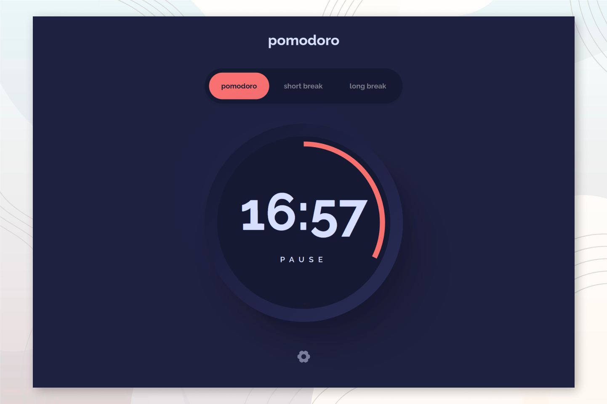

# Frontend Mentor - Pomodoro app

### The challenge

Users should be able to:

- Set a Pomodoro timer and short & long break timers
- Customize how long each timer runs for
- See a circular progress bar that updates every minute and represents how far through their timer they are
- Customize the appearance of the app with the ability to set preferences for colors and fonts

### Built with

 React (Hooks, Context API)

 Redux Toolkit

### Screenshot

### Links

- Solution URL: [GitHub](https://github.com/DorottyaB/pomodoro-with-react-redux)
- Live Site URL: 

## Author

- Website - [Dorottya](https://github.com/DorottyaB)
